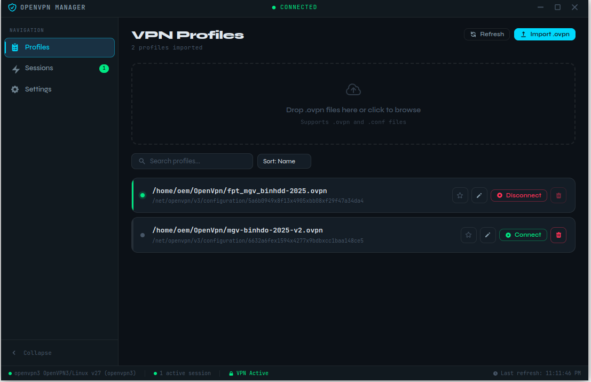
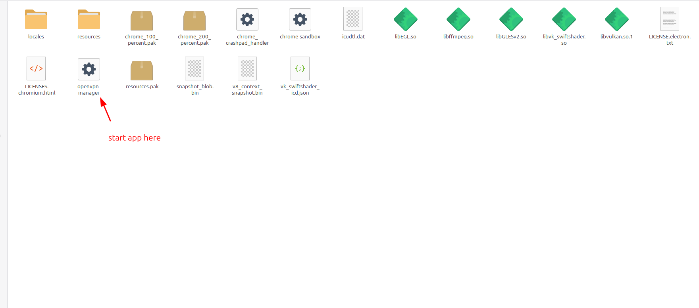

# OpenVPN Manager

A desktop application for managing OpenVPN3 connections on Linux (linux mint), built with Electron, TypeScript, and React.
For normal use just download release > extract > run "openvpn-manager" > done


---

## Screenshots

The application features:
- **Dark industrial terminal aesthetic** — cyan accent on deep navy
- **Sidebar navigation** — Profiles, Sessions, Settings (collapsible)
- **Profile cards** — with connect/disconnect, favorites, tags, notes
- **Session monitor** — live stats (IP, duration, bytes), auto-refresh
- **Settings panel** — dark/light mode toggle, auto-refresh interval

---

## Prerequisites

### Node.js
```bash
# Install Node.js 22+ via nvm (recommended)
curl -o- https://raw.githubusercontent.com/nvm-sh/nvm/v0.39.7/install.sh | bash
nvm install 22.14.0
nvm use 22.14.0
```

### OpenVPN3 (https://community.openvpn.net/Pages/OpenVPN3Linux)
```bash
sudo apt install apt-transport-https

curl -fsSL https://packages.openvpn.net/packages-repo.gpg \
  | sudo gpg --dearmor -o /etc/apt/keyrings/openvpn.gpg

echo "deb [signed-by=/etc/apt/keyrings/openvpn.gpg] \
  https://packages.openvpn.net/openvpn3/debian \
  $(lsb_release -cs) main" \
  | sudo tee /etc/apt/sources.list.d/openvpn3.list

sudo apt update && sudo apt install openvpn3
```

---

## Setup

```bash
# 1. Install dependencies
npm install

# 2. Build TypeScript (main + renderer)
npm run build

# 3. Run the application
npm run electron
```

### Development (hot reload)
```bash
# In separate terminals or via concurrently:
npm run dev:main       # Watch-compile main process
npm run dev:renderer   # Watch-compile renderer (webpack)
npm run electron       # Start Electron (after dist/ exists)

# Or all-in-one:
npm start
```

---

## Building Packages

```bash
# Build .deb (Debian/Ubuntu)
npm run dist:deb

# Build .AppImage (portable, any distro)
npm run dist:appimage

# Build both
npm run dist
```

Outputs will be in the `release/` directory.

---

## Project Structure

```
openvpn-manager/
├── src/
│   ├── main/
│   │   ├── main.ts          # Electron main process, BrowserWindow setup
│   │   ├── preload.ts       # Context bridge — exposes safe API to renderer
│   │   └── ipcHandlers.ts   # All openvpn3 CLI calls + electron-store
│   ├── renderer/
│   │   ├── App.tsx          # Root React component, layout, state
│   │   ├── index.tsx        # ReactDOM entry point
│   │   ├── index.html       # HTML template
│   │   ├── components/
│   │   │   ├── ProfileList.tsx    # Import, list, connect, remove profiles
│   │   │   ├── SessionList.tsx    # Active session monitor
│   │   │   ├── Settings.tsx       # App settings UI
│   │   │   ├── StatusBar.tsx      # Bottom status bar
│   │   │   └── ConfirmDialog.tsx  # Reusable confirmation modal
│   │   ├── hooks/
│   │   │   └── useToast.tsx       # Toast notification context
│   │   └── styles/
│   │       └── global.css         # All CSS variables + components
│   └── shared/
│       └── types.ts          # Shared TypeScript interfaces
├── package.json
├── tsconfig.main.json
├── tsconfig.renderer.json
├── webpack.renderer.config.js
├── electron-builder.json
└── README.md
```

---

## Features

| Feature | Details |
|---|---|
| **Import profiles** | File picker dialog + drag & drop `.ovpn` |
| **List profiles** | Live from `openvpn3 configs-list --json` |
| **Connect / Disconnect** | `session-start` / `session-manage --disconnect` |
| **Active sessions** | `sessions-list --json` with auto-refresh |
| **Profile metadata** | Tags, notes, favorites — persisted via electron-store |
| **Settings** | Dark/light mode, refresh interval, sort order |
| **Window state** | Size + position remembered between launches |
| **Install guide** | Shown automatically if openvpn3 is missing |
| **Confirmations** | Delete and disconnect require confirmation |
| **Loading states** | All async actions show spinners |

---

## Architecture Notes

- **Security**: All CLI execution happens in the main process via `ipcMain.handle`. The renderer communicates through a typed `contextBridge` API — `nodeIntegration` is disabled.
- **Data storage**: `electron-store` saves settings and profile metadata in `~/.config/openvpn-manager/config.json`.
- **CLI parsing**: Uses `--json` flag for structured output; falls back to line-based parsing if unavailable.
- **Error handling**: All `exec` calls are wrapped in try/catch with stderr forwarded to the UI as toast messages.

---

## Troubleshooting

**"openvpn3: command not found"**  
Follow the install instructions in Settings → OpenVPN3 Status.

**"Permission denied" on session-start**  
Add your user to the `openvpn` group:
```bash
sudo usermod -aG openvpn $USER
# Log out and back in
```

**Sessions list is empty after connecting**  
openvpn3 may take a few seconds to establish the session. The auto-refresh will pick it up, or click Refresh manually.

**App won't start (dist/ missing)**  
Run `npm run build` before `npm run electron`.
